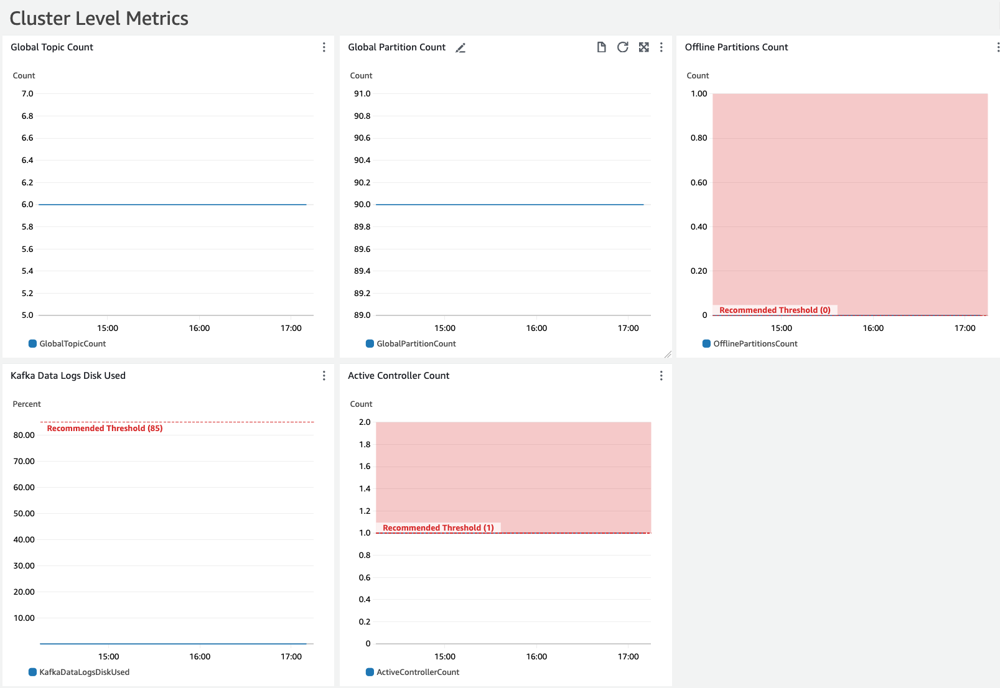
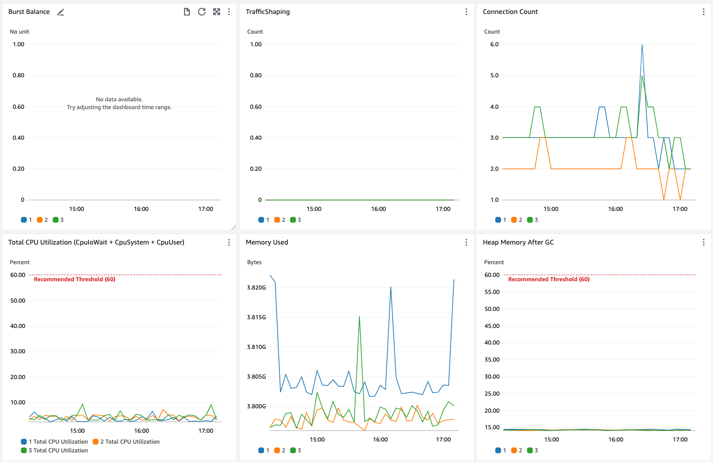
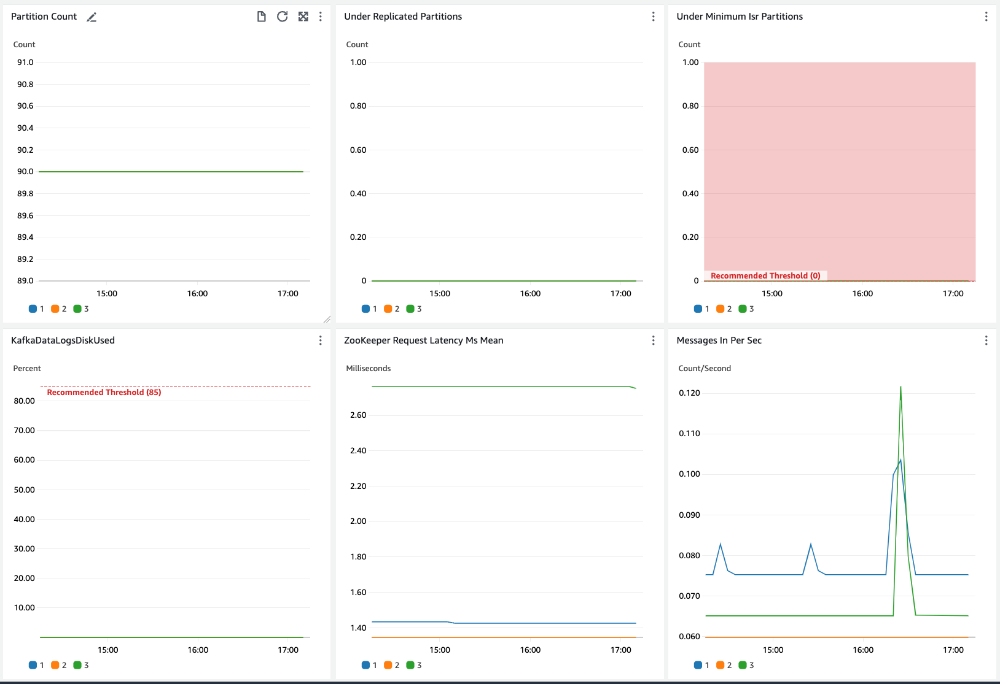
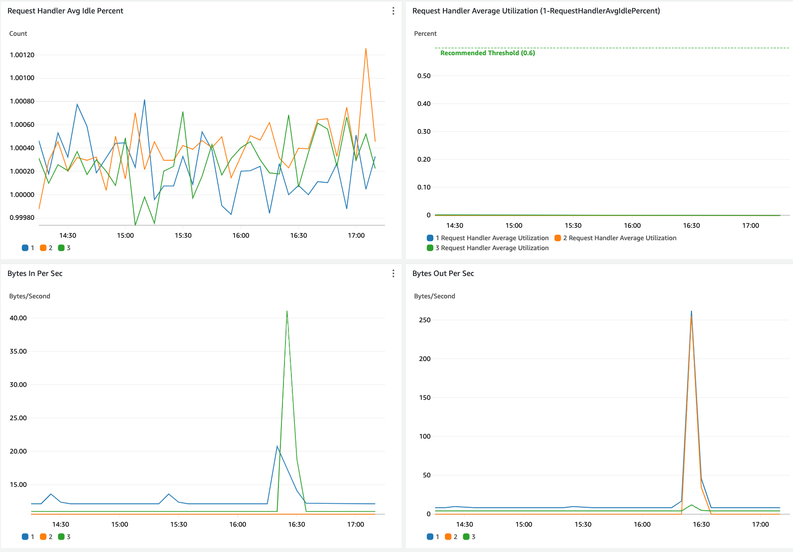
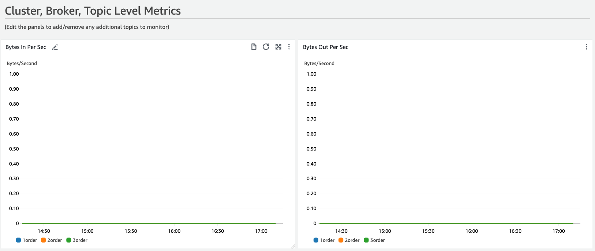
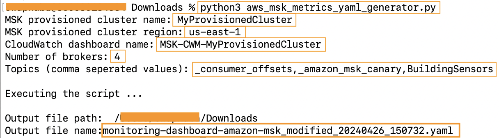
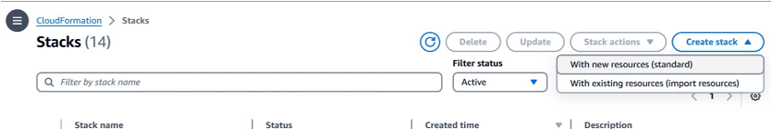
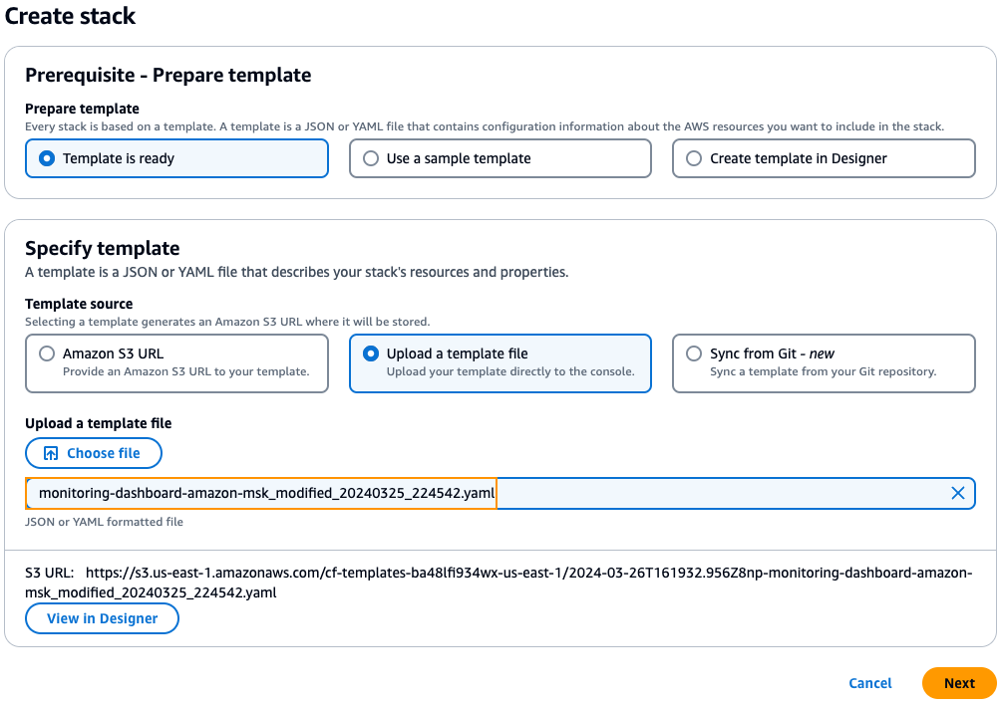
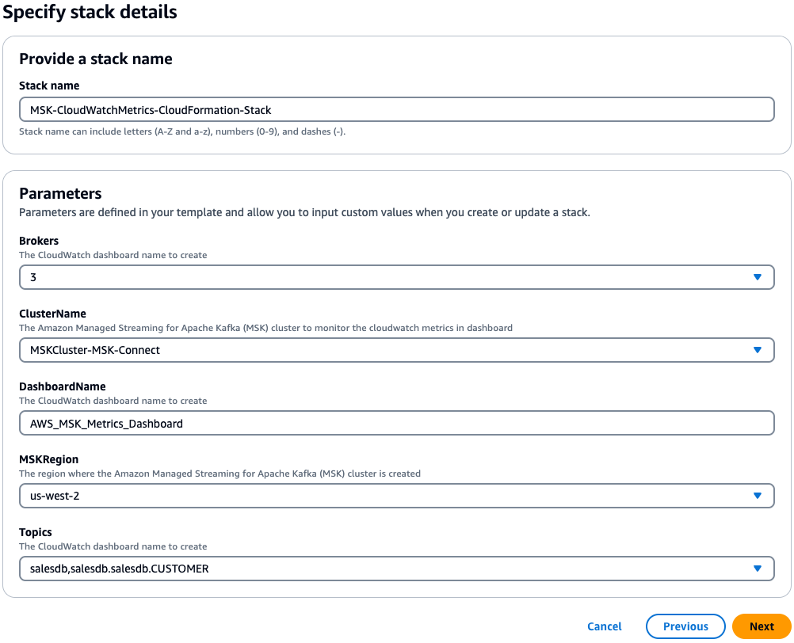
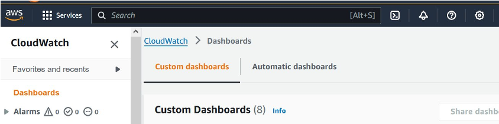

# Managed Service for Apache Kafka (MSK) Metrics Dashboard - CloudFormation Template

When running Amazon MSK, there are questions which should be addressed:

* What should be monitored? 
* What are thresholds to alert or other action(s)?

This repository contains a CloudFormation template that you can customize to deploy a CloudWatch metrics dashboard to answer these questions.  It is based on the published MSK Best Practices page at https://docs.aws.amazon.com/msk/latest/developerguide/bestpractices.html

Screenshot of the MSK CloudWatch dashboard:
 
 
 
 
 
 

## Requirements

1. Using this MSK Cloudwatch dashboard assumes you have a MSK cluster already deployed.
2. MSK Monitoring level required to use this dashboard is PER_BROKER level. You can set the monitoring level for an MSK cluster to one of the following: PER_BROKER, PER_TOPIC_PER_BROKER, or PER_TOPIC_PER_PARTITION.
Some of the metrics will not be displayed if the monitoring level is set to DEFAULT 
3. Python version 3 on your local machine

## Quickstart

1. Download _aws_msk_metrics_yaml_generator.py_ and _monitoring-dashboard-amazon-msk_source.yaml_ from this repo and save it in your local directory.

2. Execute _aws_msk_metrics_yaml_generator.py_ on your local machine and respond to following prompts to provide inputs
-   MSK provisioned cluster name: _Your cluster name_
-   MSK provisioned cluster region: _Your MSK cluster region_
-   CloudWatch dashboard name: _Name of the CloudWatch dashboard_
-   Number of brokers: _Number of brokers in the cluster to be monitored_
-   Topics (comma seperated values): Comma seperated list of Topic names 

`python3 aws_msk_metrics_yaml_generator.py`

3. Notice that a new yaml gets generated 

4. In AWS Console, go to CloudFormation and select “Create stack” >> “with new resources (standard)” to create a new stack.

5. Provide the locally generated new yaml file from step 4 by selecting "Upload a template file" option and click "Next".

6. Specify stack details

* Stack Name:  
Example: You can name your cloud formation stack as MSK-CloudWatchMetrics-CloudFormation-Stack

Rest of the parameters are auto populated based on your inputs from the Python script in step 2.

7. Leave the rest of the options default and click “Next” and “Submit”.

8. Navigate to CloudWatch >> Dashboards to access the newly created MSK monitoring dashboard with the name provided in step 4.

## Advanced

You can also configure CloudWatch alarms when the metric breaches the threshold for a specified number of evaluation periods. 

Refer to this [AWS documentation](https://docs.aws.amazon.com/AmazonCloudWatch/latest/monitoring/ConsoleAlarms.html) to configure alarms.

### Alert Examples

You can set up alarms to follow MSK best practices. Here are a couple of examples.

1.	[Monitor CPU usage](https://docs.aws.amazon.com/msk/latest/developerguide/bestpractices.html#bestpractices-monitor-cpu) – You can setup CloudWatch alarm to maintain the total CPU utilization for your brokers (defined as CPU User + CPU System) under 60%. You can scale your cluster when this alarm is triggered
2.	[Monitor disk space](https://docs.aws.amazon.com/msk/latest/developerguide/bestpractices.html#bestpractices-monitor-disk-space) - You can setup CloudWatch alarm to avoid running out of disk space for messages. When KafkaDataLogsDiskUsed reaches 85%, you can take necessary actions.

For information on how to set up and use alarms, see [Using Amazon CloudWatch Alarms](https://docs.aws.amazon.com/AmazonCloudWatch/latest/monitoring/AlarmThatSendsEmail.html). For a full list of Amazon MSK metrics, see [Monitoring an Amazon MSK cluster](https://docs.aws.amazon.com/msk/latest/developerguide/monitoring.html).

## Future Roadmap
* Update MSK Labs Monitoring to incorporate recommended CloudWatch dashboard
* How to deploy via CLI outside of AWS Console
* Automate the creation of initial set of alerts
* Build Open Monitoring based dashboard example according to MSK Best Practices; i.e. Grafana/ Prometheus

  

# Additional Information

Amazon MSK integrates with Amazon CloudWatch so that you can collect, view, and analyze CloudWatch metrics for your Amazon MSK cluster. The metrics that you configure for your MSK cluster are automatically collected and pushed to CloudWatch. You can set the monitoring level for an MSK cluster to one of the following: DEFAULT, PER_BROKER, PER_TOPIC_PER_BROKER, or PER_TOPIC_PER_PARTITION using the CloudWatch console depending on your use case and risk tolerance. 

It is a best practice to continuously monitor your MSK cluster for cluster usage, throughput, availability, and latency and setup alerting. You can create metrics monitoring dashboard for Amazon MSK using the CloudWatch console by choosing specific metrics that you would like to monitor. 

# Clean up any unused resources

Delete the Cloud Formation stack you just created if you no longer need to monitor your MSK cluster. 
